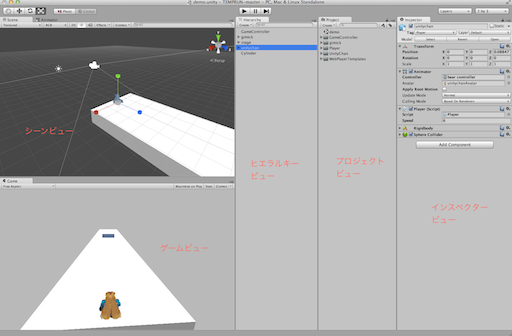

#Temp Run with Unity-chan!

*  利用するアセット [http://unity-chan.com/download/guideline.html](http://unity-chan.com/download/guideline.html)
*  完成ゲーム
*  Unity 4.5.1想定


#環境を揃える

##プロジェクトの作成

まずはUnityエディタを起動します。エディタを起動すると場合によってはカッコ良いデモが出るかもしれません。今回は新しくゲームを作成するので、プロジェクトを新規作成します。

*  メニューバーのFile>New Projectを選択します。
*  Project WIzardで、Create new Projectを選択します
*  Setup defualt forを3Dに設定します。
*  Create Projetを選択します。

Create Projectを選択した時、

##画面を一致させる

画面を一致させるために、レイアウト情報を一致させます。

*  プロジェクトを **3Dモード** で作成
*  右端の項目を **2 by 3** に設定
*  Projectビューを **One Column Layout** へ変更
*  画面左上の **CenterをPivot**、**LocalをGloval** へ変更
*  Gameビューの **Free Aspect** を **4:3** へ設定

#エディタの説明

画面レイアウトが一致した所でエディタを説明します。



## Scene Veiw

Scene View (シーンビュー)と読みます。

シーンビューを説明する前にシーンについて説明します。シーンとはUnityのゲーム開発の基本で、ゲーム内の世界を指します。

この仮想空間・シーン内にプレイヤーや地面・光源、 2DゲームであればUIやボタン、パズルゲームであればパネル・アイコン等を配置し、ゲームを構築していくのがUnity上でのゲームの作り方です。

この配置するオブジェクトは **GameObject(ゲームオブジェクト)** と呼び、コンポーネントを追加する事でどのような振る舞いも可能なコンテナです。

シーンビューはこの仮想空間を眺める窓です。ゲーム開発社はシーンビューよりシーン内に構築されるゲームを眺め・調整しながらゲームを開発することが出来ます。

## Game View

Game View（ゲームビュー）と読みます。

ゲームビューは、カメラの機能を持つCameraコンポーネントが撮影した画面です。この撮影結果はそのままゲーム画面となります。

## Hierarhy View

Hierarchy View（ヒエラルキー・ビュー）と読みます。

ヒエラルキーはシーン内に配置したオブジェクトを階層的に表示したビューです。この項目から選択する事で、ゲーム内に散らばった様々なオブジェクトに簡単にアクセスすることが出来ます。

またオブジェクトの親子構造を表現する際にも使用されます。

## Inspector View

Inspector View（インスペクター・ビュー）と読みます。

この項目は、ゲームオブジェクトが持つ振る舞い・機能の一覧を確認することが出来ます。また、振る舞いの調整等もインスペクタービューより行います。

#シーンを構築する

## シーンの保存

それではシーンを構築していきましょう。

まず、新しくシーンを作成します。シーンの保存の有無を聞かれる場合がありますが、Noとして下さい。

*  **File -> New Scene を選択**して下さい。

シーンを作成すると、Main Cameraが一つのみの簡単なシーンが作成されます。とりあえず、このシーンを保存しましょう。

*  **File -> Save Scene を選択**して下さい。

ファイル名を聞かれます。名前は **Game** とします。この名前は適当でも良いですが、日本語名は避けておいたほうが無難です。また、出来る限り重複しない名前が良いでしょう。この作業が完了すると、Game.unityファイルが作成されます。
シーンの保存はUnityで作業を進める上で非常に重要な要素の一つです。ゲーム開発を進める上でこま目に保存する癖をつけましょう。

<!-- ■■■■■■■■■■■■■■■■■■■■■■■■■■■■■■■■■■■■■■■■■■■■■　SAVE　■■■■■■■■■■■■■■■■■■■■■■■■■■■■■■■■■■■■■■■■■■■■■■■■■■■■■■■■■  -->

## 地面を作成

次に地面とライトを作成します。今回は簡単なゲームをつくるだけなので、簡単にボックスオブジェクトを引き伸ばすだけで何とかします。まずは地面を作成します。

* Hierarchy（ヒエラルキー）の **Create(クリエイト)** より**Cube(キューブ)**を選択します。

画面に真っ黒なボックスが作成されました。今回のゲームは縦長の地面なので、これを引き伸ばします。

オブジェクトのサイズや位置を変更するには、InspectorのTransformもしくはシーンビューからscale（大きさ）やposition（位置）を移動します。多くのケースではアーティストの感性で操作しやすいシーンビューから操作しますが、今回はTransformから操作します。なお、日本語入力がONになっている場合、文字が入力できないケースが有ります。その際は入力を英字にして下さい。

*  Cubeを選択し、Transformのpositionを **x:0, y:-0.5, z:30** とします。次にscaleを **x:4, y:1, z:70** に設定します。
*  同様に、インスペクタービュー上部の名称を設定する項目でCubeの名前を**Ground**に設定します。

<!-- ■■■■■■■■■■■■■■■■■■■■■■■■■■■■■■■■■■■■■■■■■■■■■　SAVE　■■■■■■■■■■■■■■■■■■■■■■■■■■■■■■■■■■■■■■■■■■■■■■■■■■■■■■■■■  -->

## ライトを設定


とりあえず、画面に何かのオブジェクトを配置する事が出来ました。しかしゲームビューを確認するとライトが無く暗いままなので、ライトを作成しましょう。

*  ヒエラルキービューのCreateボタンを選択し、**Directional Light（ディレクショナルライト）** を選択します。

ライトを作成すると、地面の形状がハッキリわかるようになります。ついでに影も付けましょう。

*  ヒエラルキービューで先ほど作成したDirectional lightを選択し、Shadow Typeを Hard Shadows を設定します。

<!-- ■■■■■■■■■■■■■■■■■■■■■■■■■■■■■■■■■■■■■■■■■■■■■　SAVE　■■■■■■■■■■■■■■■■■■■■■■■■■■■■■■■■■■■■■■■■■■■■■■■■■■■■■■■■■  -->


#キャラクターを配置


次にキャラクターを配置します。

今回はキャラクターにユニティちゃんを使用します。

まずUnityちゃんをダウンロードしインポートしましょう。規約にも書いてありますが、ユニティちゃんを使用する場合、ユニティちゃんマークを載せる必要がある事に注意して下さい。

*  [http://unity-chan.com/download/guideline.html](http://unity-chan.com/download/guideline.html)よりデータをダウンロードします。ダウンロードするのは、**ユニティちゃん データ**です。
*  ダウンロードしたパッケージをダブルクリックしてインポートします。

インポートが完了すると、プロジェクトビューにUnitychanフォルダとWebPlayerTemplatesが追加されます。
インポートする際、パッケージを配置したフォルダパスに日本語が含まれている場合、インポートに失敗することがあります。デスクトップではなくC:¥直下や適当なフォルダに移動してからパッケージをダブルクリックしてインポートしましょう。

<!-- ■■■■■■■■■■■■■■■■■■■■■■■■■■■■■■■■■■■■■■■■■■■■■　SAVE　■■■■■■■■■■■■■■■■■■■■■■■■■■■■■■■■■■■■■■■■■■■■■■■■■■■■■■■■■  -->

##ユニティちゃん登場

インポートしたらユニティちゃんに登場してもらいましょう。

正しくユニティちゃんがインポートされている場合、ProjectビューのUnityCan/Modelsの下にunitychan.fbxがあります。このファイルを使用してユニティちゃんをシーンへ登録します。

*  プロジェクトビューのUnityChan/Model/unitychan.fbxをヒエラルキービューへドラッグ＆ドロップします。

シーンにユニティちゃんが配置されました。さっそくシーンを再生してみましょう。Unityではゲームを実行しシーン内のオブジェクトを動かすことを、**シーンを再生する** と言う場合があります。
シーンを再生するには、シーン再生ボタンをクリックします。シーン再生ボタンはエディタ上の三角ボタンです。

*  シーン再生ボタンをクリックします。

何も起きません。ユニティちゃんを描画しているunitychanオブジェクトは「ユニティちゃんを描画する」振る舞いを持っては居ますが、アニメーションを再生する機能が実行されていません。今度はアニメーションを再生するように調整しようと思います。

<!-- ■■■■■■■■■■■■■■■■■■■■■■■■■■■■■■■■■■■■■■■■■■■■■　SAVE　■■■■■■■■■■■■■■■■■■■■■■■■■■■■■■■■■■■■■■■■■■■■■■■■■■■■■■■■■  -->

##Animator Controllerの作成

ユニティのアニメーションは現在はmecanim(メカニム)と呼ばれるシステムにより管理されています。mecanimはノードベースのアニメーション管理システムで、パラメータを与えると自身が行うべきアニメーションを選択して実行する性質を持ちます。まずはmecanimを管理するAnimator Controller（アニメーターコントローラー）を作成します。

*  プロジェクトビューのCreateよりAnimator Controllerを選択します。
*  作成したファイル名は **ucAC** とします。

ACはAnimatorControllerの略です。基本的に業務で使う上では略さない方が良いのですが、今回は面倒なので略します。

次に、作成したucACをシーン内に配置したユニティちゃんに登録します。

*  ucACを選択して、ヒエラルキービュー内に先ほど配置したunitychanへドラッグ＆ドロップします。

unitychanを選択した際に、InspectorのAnimatorコンポーネントのControllerにucACが登録されていれば成功です。

なお、今回のモーションではモーション内で座標の移動を行っていませんので、モーション内でキャラクターを動かす設定の Apply Root Motionのチェックを外しておきます。

*  AnimatorのApply Root Motionのチェックを外します。

<!-- ■■■■■■■■■■■■■■■■■■■■■■■■■■■■■■■■■■■■■■■■■■■■■　SAVE　■■■■■■■■■■■■■■■■■■■■■■■■■■■■■■■■■■■■■■■■■■■■■■■■■■■■■■■■■  -->

##Animatorへのアニメーション追加

Animatorの挙動を設定しましょう。Animatorの設定はAnimatorビューから行います。この項目は非常にややこしいので、よく聞いて下さい。

*  ヒエラルキービューのunitychanを選択します。
*  インスペクタービューからAnimatorからucACをダブルクリックし、Animatorビューを開きます。

これでアニメーションを追加する準備が整いました。今のところ、ANY STATEが一つあるだけのノードが確認出来ます。では、走るモーションを追加します。

*  プロジェクトビューのUnityChan/Animations/unitychan_RUN00_F/RUN00_Fを選択し、Animatorビューの適当な位置（真ん中付近が良いでしょう）へドラッグ＆ドロップします。

再生してみましょう。ユニティちゃんが走りだす事が確認出来ます。

<!-- ■■■■■■■■■■■■■■■■■■■■■■■■■■■■■■■■■■■■■■■■■■■■■　SAVE　■■■■■■■■■■■■■■■■■■■■■■■■■■■■■■■■■■■■■■■■■■■■■■■■■■■■■■■■■  -->

##モーションの切替

続いて行きましょう。ジャンプとスライディングのモーションを追加します。

ジャンプは、UnityChan/Animations/unitychan_JUMP00/Jump00、スライディングはUnityChan/Animations/unitychan_SLIDE00/SLIDE00にあります。早速先ほどの方法を使ってAnimatorへ登録しましょう。

*  Jump00とSLIDE00アニメーションをAnimatorビューへドラッグ＆ドロップし、ucACへ登録します。

早速再生してみてください。今度もRUn00が実行され、先ほど登録したジャンプやスライディングのモーションは再生されません。Animatorは、**Set As Default**で指定したアニメーションを最初に再生し、状態（state）の変更が無ければそのまま同じアニメーションを再生し続けます。

状態を切り替えるギミックを追加します。この状態が切り替わることをTransition（トランジション）と言います。まず、スライディングと走るを交互に切り替える機能を追加しましょう。少し複雑な手順なのでよく見ていて下さい。

*  AnimatorビューのRun00_Fを選択し、右クリックからMake Transitionを選択、SLIDE00へドラッグ＆ドロップします。
*  AnimatorビューのSLIDE00を選択し、右クリックからMake Transitionを選択、Run00_Fへドラッグ＆ドロップします。

再生すると、「走る」と「スライディング」のモーションを交互に実行するようになります。

なお、この矢印を消すには Ctrl（macの場合はCommand）を押しながらDeleteキーです。

<!-- ■■■■■■■■■■■■■■■■■■■■■■■■■■■■■■■■■■■■■■■■■■■■■　SAVE　■■■■■■■■■■■■■■■■■■■■■■■■■■■■■■■■■■■■■■■■■■■■■■■■■■■■■■■■■  -->

##モーション切替の制御

次にスライディングするタイミングを制御できるようにします。現在交互にアニメーションが変化しているのは、状態の切替条件が時間になっているからです。この条件に、「パラメータが変化したタイミング」を追加します。

AnimatorのパラメータはAnimatorビュー左下のParameters（パラメーターズ）から制御します。以下の手順で、パラメータにSLIDEを追加します。

1.  AnimatorビューのParametersの隣の「＋」をクリックし、Triggerを選択します。
2.  名前をSLIDEとします。

次にアニメーションの状態がRUN00からSLIDE00へ切り替わる条件を変更します。

1.  AnimatorビューでRUN00からSLIDE00への矢印を選択します。
2.  Inspectorを確認し、Conditions（コンディションズ）の設定をExit Time（時間指定）からSLIDEへ変更します。

再生してみてください。再生中にParametersのSLIDEにチェックを入れると、アニメーションが切り替わるようになるはずです。またアニメーション再生が完了すると、RUN00へ戻る事が分かります。

同様の手順でパラメータにJUMPを追加し、ジャンプにチェックを入れるとジャンプするようにしてみましょう。

<!-- ■■■■■■■■■■■■■■■■■■■■■■■■■■■■■■■■■■■■■■■■■■■■■　SAVE　■■■■■■■■■■■■■■■■■■■■■■■■■■■■■■■■■■■■■■■■■■■■■■■■■■■■■■■■■  -->

##いつでも呼びだせるアニメーションを追加

最後にユニティちゃんが失敗した際のモーションを追加します。まずは転倒モーションと、落ち込むモーションを追加します。

*  UnityChan/Animations/unitychan_DAMAGED01/DAMAGED01をAnimatorへドラッグ＆ドロップする。
*  UnityChan/Animations/unitychan_LOSE00/LOSE00をAnimatorへドラッグ＆ドロップする。

想定では、転倒後に落ち込む流れを作りたいので、Damage01からLOSE00への矢印を貼ります。状態が切り替わる条件はアニメーションが完了(Exit Time)のまま変更しません。

最後にDAMAGE00への参照を考えます。今までであれば何らかの状態から矢印を貼っていましたが、転倒はどの状態からでも考えられます。しかし、全ての状態からDAMAGE01へ矢印を貼るのは面倒すぎます。その場合は、Any State（エニーステイト） を使用します。

Any Stateは、条件が揃えばどこからでも移動出来る状態です。ダメージを受けた場合この項目から状態を切り替えるようにします。

*  Any StateからMake TransitionでDamage01への矢印を作成します。
*  Parametersに「＋」を選択し、Triggerを選択。条件名はDEADとします。
*  Any StateからDmaage01への矢印を選択し、conditionの設定を「DEAD」とします。

再生してみましょう。チェックを入れたり外したりする事で、アニメーションが切り替わるのが確認できます。
<!-- ■■■■■■■■■■■■■■■■■■■■■■■■■■■■■■■■■■■■■■■■■■■■■　SAVE　■■■■■■■■■■■■■■■■■■■■■■■■■■■■■■■■■■■■■■■■■■■■■■■■■■■■■■■■■  -->


#キャラクターの移動

次にユニティちゃんを前進させます。前進させる機能はあるにはあるのですが、今回はPlayerを制御するスクリプトを作成して管理してもらう事にしましょう。

##Playerコンポーネントの作成

まずはコンポーネントを作成します。コンポーネントとはGameObjectを制御するスクリプトです。コンポーネントはその性質上、クラスとも呼ばれる事があります。Unityはコンポーネント間のメッセージのやり取り（メッセージング）と、挙動（ビヘイビア）によってゲームを構築します。

まずはスクリプトを作成してみましょう。

*  プロジェクトビューのCreateをクリックし、C# Scriptを選択します。
*  作成したScirptの名前はPlayerとします。


```
using UnityEngine;
using System.Collections;

public class Player : MonoBehaviour {

	// Use this for initialization
	void Start () {
	
	}
	
	// Update is called once per frame
	void Update () {
	
	}
}
````

<!-- ■■■■■■■■■■■■■■■■■■■■■■■■■■■■■■■■■■■■■■■■■■■■■　SAVE　■■■■■■■■■■■■■■■■■■■■■■■■■■■■■■■■■■■■■■■■■■■■■■■■■■■■■■■■■  -->

作業が完了したらヒエラルキービューからシーン内に配置したunitychanに先ほど作成したPlayerスクリプトをドラッグ＆ドロップして追加します。

*  シーンのunitychanを選択し、InspectorからAddComponent（アドコンポーネント）をクリック、Script -> Player を選択します。

うまくいかない場合、 先ほど作成したスクリプトの中の文章が、pbulic class Player ではなく public class NewBehaviourScript となっていないか確認してください。public class **** の****の項目はファイル名と一致している必要があります。

<!-- ■■■■■■■■■■■■■■■■■■■■■■■■■■■■■■■■■■■■■■■■■■■■■　SAVE　■■■■■■■■■■■■■■■■■■■■■■■■■■■■■■■■■■■■■■■■■■■■■■■■■■■■■■■■■  -->


##前進させる

ユニティちゃんを前進させます。

まずシーンのunitychanにRigidbodyを追加します。これは、当たり判定がある物を前進させる場合に必要なものですので、物を動かす場合（特に2D）では必ず付与して下さい。しかし今回は物理演算は不要なので、IsKinematicにチェックを入れます。この項目は、物理演算をしない場合にチェックを入れます。

*  シーンのunitychanを選択し、InspectorのAdd Componentをクリックし、Physics（フィジックス）ー＞Rigidbodyを選択します
*  先ほど追加したRigidbodyコンポーネントを開き、IsKinematicにチェックを入れます。

<!-- ■■■■■■■■■■■■■■■■■■■■■■■■■■■■■■■■■■■■■■■■■■■■■　SAVE　■■■■■■■■■■■■■■■■■■■■■■■■■■■■■■■■■■■■■■■■■■■■■■■■■■■■■■■■■  -->

次にユニティちゃんを前進させます。

*  以下のコードの(1)を Player.csファイルのpublic class Player : MonoBehaviour { の次の行に追記して下さい。
*  同様に、以下のコードの(2)を void Update() { の次の行、　} の間に追記して下さい。


```
// (1)
public float speed = 6;

// (2)
rigidbody.MovePosition (transform.position + transform.forward * Time.deltaTime * speed);
```

補足しておくと、Updateの{から}内に記述したソースコードは、毎フレーム呼び出され実行されます。そのため今回記述した(2)の処理は毎フレームSpeedで指定した速度の分だけ前進するといった内容になります。

もう少し正しく言えば、Playerの座標(transform.position) に オブジェクトの前方(transform.forward) × 速度(speed) の分を足した座標へマイフレーム移動しています。

<!-- ■■■■■■■■■■■■■■■■■■■■■■■■■■■■■■■■■■■■■■■■■■■■■　SAVE　■■■■■■■■■■■■■■■■■■■■■■■■■■■■■■■■■■■■■■■■■■■■■■■■■■■■■■■■■  -->

##カメラを追随させる

このままでは、カメラを放置してユニティちゃんが走りだしてしまいます。カメラを追随させる一番簡単な方法は、ユニティちゃんの子オブジェクトとしてカメラを配置する事です。カメラをユニティちゃんの子オブジェクトとして配置しましょう。

*  シーン内のunitychanへMainCameraをドラッグ＆ドロップして親子構造を作ります。
*  カメラのpositionを(0, 2.3, -3)、rotationを( 26, 0, 0)を設定します。

<!-- ■■■■■■■■■■■■■■■■■■■■■■■■■■■■■■■■■■■■■■■■■■■■■　SAVE　■■■■■■■■■■■■■■■■■■■■■■■■■■■■■■■■■■■■■■■■■■■■■■■■■■■■■■■■■  -->


##ジャンプ・スライディングする

次にボタンを押すとジャンプ・スライディングするように設定します。

ジャンプ・スライディングさせるには、Playerコンポーネントから別のコンポーネントへアクセスする必要があります。それが同一オブジェクトへ登録されているコンポーネントであれば、ユニティは非常に簡単にコンポーネントを取得する事が可能です。

同一オブジェクトからGetComponent<コンポーネント名>()で取得する事ができます。今回はAnimatorを取得するので、GetComponent<Animator>()と記載します。
次に、取得したAnimatorのSLIDEやJUMPにチェックをスクリプトから入れます。この処理は、SetTrigger(パラメータ名)で行います。

つまり、以下のコードを void Update(){から}までの間に追加します。

```
//(3)
GetComponent<Animator>().SetTrigger("JUMP");
```

シーンを再生しましょう。ユニティちゃんがウサギの如く跳ねながら前進していくのが分かります。これは、毎フレームJUMPにチェックが入っているのが原因です。この対策に、入力があった場合のみJUMPにチェックが入るように修正します。


<!-- ■■■■■■■■■■■■■■■■■■■■■■■■■■■■■■■■■■■■■■■■■■■■■　SAVE　■■■■■■■■■■■■■■■■■■■■■■■■■■■■■■■■■■■■■■■■■■■■■■■■■■■■■■■■■  -->

ボタンの入力を待ち受けるには、Input.GetButtonDownがあるかを判断するのが良さそうです。　

処理の分岐はif文を使用します。　この構文は、if(処理){　の処理の部分が正(true)の場合に、{の次の命令が実行される構文です。
先ほど記述した内容(3)を削除し、以下のような処理を void Update(){から}の間のいずれかに記述しましょう。

ちなみにFire1は、パッドのボタン１もしくはCtrlキーです。

```
//(3)
if( Input.GetButtonDown("Fire1")){
	GetComponent<Animator>().SetTrigger("JUMP");
}
```

同様の手順で、Fire2ボタンでSLIDEするようにしてみましょう。
Fire2はAltです。上手くいけば、AltとCtrlでジャンプ・スライディングするようになります。


<!-- ■■■■■■■■■■■■■■■■■■■■■■■■■■■■■■■■■■■■■■■■■■■■■　SAVE　■■■■■■■■■■■■■■■■■■■■■■■■■■■■■■■■■■■■■■■■■■■■■■■■■■■■■■■■■  -->


#障害物を配置する

ジャンプとスライディングが出来るようになったので、今度は障害物を配置してみましょう。

##障害物を作成

まずは障害物として、薄い板のオブジェクトを作成します。

*  ヒエラルキービューのCrateを選択し、Cubeを選択します。
*  Positionを(0, 0, 10)に設定します。
*  Scaleの値を(3, 1, 0.05) に設定します。
*  作成したオブジェクトの名前をLowとします。

これで、ハードルとなるオブジェクトが出来ました。
次はオブジェクトの色を変更してみましょう。

色を変更する一番簡単な方法は、マテリアルの色を変更する事です。この作業を行うにはマテリアルが必要です。マテリアルを作成し色を設定します。

*  プロジェクトビューのCreateを選択し、Materialを選択します。
*  ファイルが作成されますので、名前をLowMaterialに変更します。
*  作成したマテリアルをヒエラルキービューのLowオブジェクトへドラッグ＆ドロップします。
*  Lowオブジェクトを選択し、インスペクタービューのLow MaterialのMainColorを変更します。

最後に、障害物を貫通出来るように当たり判定をTriggerに設定します。Unityの当たり判定は物理演算に従い貫通しないようになっています。しかし、ハードル等は貫通する想定で考えても良いので、このLow関しては「当たったこと」を確認するためだけに使用します。Triggerに設定するには、***ColliderのオブジェクトのIsTriggerにチェックを入れます。

*  LowオブジェクトのColiderのIs Triggerにチェックを入れます。

##障害物を簡単に量産可能にする

障害物をコピー＆ペーストするのは良いですが、障害物を量産しやすくするためにプレハブ化を行います。プレハブ化を行う事で、特定のオブジェクトを雛形（プレハブ）とし作成・変更を簡単に出来るようになります。プレハブ化を行うには、対象のオブジェクトを選択しプロジェクトビューへドラッグ＆ドロップします。

*  Lowオブジェクトを選択し、プロジェクトビューへドラッグ＆ドロップします。

#障害物を回避する

障害物とユニティちゃんを連携し、ユニティちゃんが障害物に接触したらゲームオーバーになるようにします。また、ジャンプ中はハードルに接触しないようにします。


##ブロックと接触したユニティちゃんを転倒させる

接触したらユニティちゃんが転倒してゲームオーバーするようにします。

接触の判定にはPlayerコンポーネントに機能を追加します。追加する内容は「接触したら呼び出されるイベント」と「イベント内の処理」です。

まずはTriggerに接触した場合に呼び出すイベントをPlayerコンポーネントに定義し、接触した際の処理を定義します。接触した際のイベントは　void OnTriggerEnter (Collider colider)　です。


*  Playerコンポーネントの void Update(){ ...中略... } の次の行に、 コード(4)を記述します。
*  (4)で記述したコードの {と}の間に、コード(5)を記述します。


```
// (4)
void OnTriggerEnter (Collider colider)
{
}
```

```
// (5)
GetComponent<Animator>().SetBool ("DEAD", true);
speed = 0;
```

##ユニティちゃんに当たり判定を付ける

再生して見て下さい。接触しても何も反応が無いと思います。
ユニティちゃんと接触させるには、お互いにコライダーがある必要があります。

ユニティちゃんにコライダーを付与しましょう。

*  シーン内のUnitychanを選択します。
*  インスペクタービューのAdd Componentをクリックします。
*  Physics > Sphere Colliderを選択します。

シーンで確認すると、コライダーの位置が若干下になっています。
このコライダーを変更しましょう。

*  シーン内のユニティちゃんのSphere ColliderのCenterの値を、(0, 0.7, 0）に設定します。
*  colliderのradiusの値を0.7に設定します。

##オブジェクトを回避可能にする

ジャンプ中はオブジェクトを接触しても転倒しないようにします。

今回の比較にはAnimatorの状態をそのまま使用しようと思います。プレイヤーのAnimatorの状態を取得し、ジャンプ中ならブロックに接触しても何も反応させないようにします。

つまり、AnimatorからGetCurrentAnimatorStateInfoで状態を取得し、その値が「RUN」でないなら（ジャンプ中・もしくはスライディング中なら） 処理をスキップします。

*  Animatorの状態を取得するため、(6)のコードを(4)の { の次の行に記述します。
*  上で作成した判定を利用して、処理をスキップするため、前回書いた内容(5)を(7)のように改造します。


```
// (6)
var stateInfo = GetComponent<Animator>().GetCurrentAnimatorStateInfo (0);
bool isRun = stateInfo.IsName("Base Layer.RUN00_F");
```

```
// (7)
if( isRun == true )
{
	GetComponent<Animator>().SetTrigger ("DEAD");
	speed = 0;
}

```

##ジャンプとスライディングで障害物を回避する

ジャンプとスライディングがあるので、スライディングでも回避する状況を作りましょう。


まずは、障害物を「high(高い)」と「low(低い)」の二種類に分類します。分類の方法は、高さからとっても良いのですが、調整が面倒なのでタグで管理します。

まずはタグを作成します。

*  メニューのEdit > Project Settins > Tag & Layers を選択します。
*  インスペクタービューのTagsを開き、Elementを2に設定、HighとLowを追加します（頭大文字な点に注意して下さい）。

次に、オブジェクトを作成しタグを設定します。

*  ヒエラルキービューのCrateよりCubeを作成します。
*  作成したCubeを選択し、インスペクタービューよりHighをと改名します。
*  HighのBoxColliderのIsTriggerにチェックを入れます。
*  作成したHighのPositionを(0, 1, 20)に設定します。
*  作成したHighのScaleの値を(3, 0.5, 0.05) に設定します。
*  HighのタグをHighに設定します。
*  Highをプロジェクトビューへドラッグ＆ドロップしてプレハブ化します。


ついでに、以前作成したLowオブジェクトのタグを変更しておきましょう。

*  プロジェクトビューのLowプレハブを選択し、インスペクタービューでTagをLowに設定します。

後は接触対象によりPlayerの振る舞いを変更します。接触対象の情報はOnTriggerEnterの引数（colider）から得ることが出来ます。多くの場合、この文字列に「.（ドット）」を追加する事で、このオブジェクトが持つパラメータや値を取得する事ができます。この機能を使用して接触対象がHighかLowか判定しましょう。

*  (8)のコードを、(6)の次の行に記述します。
*  以前書いた接触判定(7)を削除し、(9)のように変更します。(8)のコードは、「ジャンプ中に高い物があたったら…」の条件です。条件を指定する場合、 括弧（）で囲った物を先に計算し、 || でどちらかがOKなら、&& で両方OKなら次の行を実行します。これを応用して、以下のように改造します。

```
//(8)
bool isHigh = colider.CompareTag("High");
bool isLow = colider.CompareTag("Low");

bool isJump = stateInfo.IsName("Base Layer.JUMP00");
bool isSlide = stateInfo.IsName("Base Layer.SLIDE00");

```

```
// (9)
if (isRun == true || 
	(isJump == true && isHigh == true))
{
	GetComponent<Animator>().SetBool ("DEAD", true);
	speed = 0;
}
```

さらに複雑な条件を追加しましょう。「スライディング中にLowに当たったら」を追加します。
(9)のコードを(10)に変更します。

```
// (10)
if( (isRun == true) ||
    (isJump == true && isHigh == true) ||
    (isSlide == true && isLow == true))
{
	GetComponent<Animator>().SetBool ("DEAD", true);
	speed = 0;
}
```


#適当にステージを作ってみよう

これで簡単なゲーム作成のチュートリアルは完了です。
後はブロックを大量に配置することで、様々なステージが作成出来るようになりました。
簡単なステージを作成してみましょう。